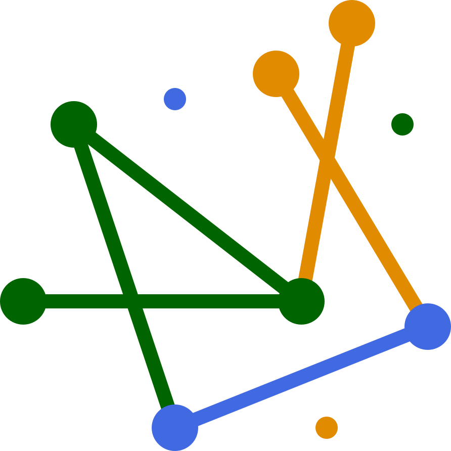

<h1>
  
  Connectivity Explorer
</h1>

[](https://github.com/deangeckt/connectivity_explorer/actions)
[](https://github.com/deangeckt/connectivity_explorer/stargazers)
[](https://github.com/deangeckt/connectivity_explorer/issues)

A free, browser-based [**interactive 3D viewer**](https://deangeckt.github.io/connectivity_explorer) for cortical neuron connectivity - no installation or login required.
Pick a source neuron, sample its synaptic targets, and explore their skeletons and synapse locations in real time, then continue your analysis directly in Neuroglancer.

Data is from the [MICrONS](https://www.microns-explorer.org/) cortical column dataset (v1718): ~1,300 neurons and ~146K intrinsic synapses.
Faint gray skeletons in the background are neurons from the 1 mm³ volume outside the column, shown for spatial context.


https://github.com/user-attachments/assets/e37adec4-5262-4096-a9c2-a62765b9dd87


## Getting Started

```bash
git clone https://github.com/deangeckt/connectivity_explorer.git
cd connectivity_explorer
npm install
npm start
```

The app will open at `http://localhost:3000`.


## Local Development

```bash
npm start      # development server with hot reload
npm run build  # production bundle
```

## Citation

If you use Connectivity Explorer in your work, please cite:

```bibtex
@software{geckt2026neurons,
  author  = {Geckt, Dean},
  title   = {Connectivity Explorer: Interactive 3D Browser for Cortical Neuron Connectivity},
  year    = {2026},
  url     = {https://github.com/deangeckt/connectivity_explorer}
}
```

## Acknowledgments

- Data provided by the [MICrONS Project](https://www.microns-explorer.org/) - a large-scale electron-microscopy reconstruction of a cortical column from mouse visual cortex.


- This is a fork of my previous open-source online-tool: the [SWC Editor](https://github.com/deangeckt/swc_editor), turned, with the help of Claude to this Explorer.
